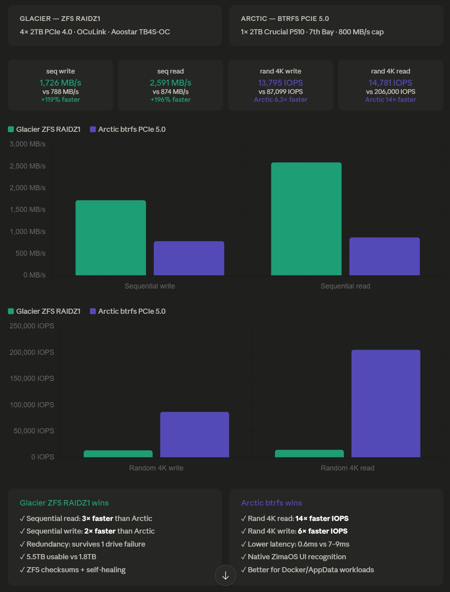

# ZimaCube 2 Build — Phase 1: Foundation & Storage

**Author:** ted-knight  
**Status:** 🟡 In Progress  
**Started:** May 21, 2026  
**Updated:** June 04, 2026  
**Program:** ZimaCube 2 Pioneer Program  

---

## Table of Contents

1. [Goal](#goal)
2. [Completed and Pending](#completed-and-pending)
3. [Build Journey](#build-journey)
4. [Final Hardware Configuration](#final-hardware-configuration)
5. [Storage Architecture](#storage-architecture)
6. [Thunderbolt 4 Issue and OCuLink Resolution](#thunderbolt-4-issue-and-oculink-resolution)
7. [ZFS Pool Setup](#zfs-pool-setup)
8. [ZimaOS Integration](#zimaos-integration)
9. [Arctic-Storage Setup](#arctic-storage-setup)
10. [Storage Benchmarks](#storage-benchmarks)
11. [ZFS ARC Tuning](#zfs-arc-tuning)
12. [Recommended Workload Split](#recommended-workload-split)
13. [Immich Migration](#immich-migration)
14. [ZimaOS Observations](#zimaos-observations)
15. [Honest & Surprising Discoveries](#honest-surprising-discoveries)
16. [What's Coming Next](#whats-coming-next)
17. [Benchmark Scripts](#benchmark-scripts)
18. [System Information](#system-information)
19. [Resources](#resources)

> 🔬 **Full storage benchmarks** — cold baselines, the seven-run warm ZFS ARC study, write-side SLC behaviour, and the per-phase workload split — now live in their own deep-dive: **[Phase 1.5 — Storage Benchmarks](01.5-benchmarks.md)**.

---

## Goal
*I wanted a NAS I could actually trust — something I could build on top of, phase by phase, without waking up one day to find my photo library gone or a Docker app quietly corrupted. After a lot of deliberation, the [ZimaCube 2 Standard NAS](https://shop.zimaspace.com/products/zimacube-2-personal-cloud-nas) was the one. This is the story of Phase 1: getting the foundation set up, what surprised me along the way, and what I'd do differently. Spoiler: Thunderbolt 4 was not my friend.*

---

### ZimaCube 2 Standard NAS
*It came in a nice huge black box with an orange accent.*


*Front panel of ZimaCube 2 standard with 2x USB-A 3.0, 1x USB-C 3.0, 1x 3.5mm Audio Jack and a small Power Button.*


*Front Bay of ZimaCube 2 supporting 6x SATA3 3.5"/2.5" HDD trays + 7th tray supporting 4x M.2 NVMe SDDs.*


*Front HDD Tray with LED status/activity lights.*


*ZimaCube 2 — featuring a sleek silver chassis with sharp angular lines. Its understated design ensures it blends seamlessly into any space without drawing attention.*


*ZimaCube 2's minimalist back panel neatly hides its dual exhaust system, keeping the focus on sleek aesthetics rather than hardware clutter.*


*Pin-hole reset, 19V DC Power input, 2x Thunderbolt 4 or USB4-capable USB-C connections (direct attached network for compatible devices), 2x 2.5GbE network ports, 2x USB-A 3.0, 1x Display Port 1.4 and 1x HDMI 2.0*

> **For the keen eyes:** The IO shield of the ZimaCube 2 Standard came slightly displaced at the upper left. I have to open the upper shell to access the internal of ZimaCube 2 to readjust the IO shield. Could be due to shipping, it got moved.
---

### ZimaCube 2 Standard NAS (Internal)
*Unscrewing the ZimaCube 2 with the provided screwdriver to access the top panel.*


*Top overview of ZimaCube 2. First thing I have noticed is the huge CPU cooler for mobile Intel Core i3-1215U. That should ensure a cool quiet operation.*


*The original 1x Samsung 8GB SODIMM DDR5 4800 MT/s stick.*


*The original 1x Kingston 256GB PCIe4 NVMe SDD used as bootdrive and home to ZimaOS Plus.*


*Both Standard and Pro versions of the ZimaCube 2 feature versatile expansion options with one PCIe4 x4 lane (physical x16 slot) and one PCIe3 x2 lane (physical x8 slot). This configuration ensures broad compatibility with most add-on cards, provided they are low-profile to fit within the chassis dimensions.*


*The illuminated 7th bay of the ZimaCube 2 offers versatility—transform your system into an all-flash NVMe NAS with ease.*


---

### Components used for Upgrade journey


*Expand Tier 1 - Fast NVMe storage of my ZimaCube 2 from the original 256GB to additional 2TB to house folders such as AppData, Docker images, User DBs and other active workloads.*


*While a PCIe5 NVMe is overkill, it happened to be the best-priced option available given current market conditions.*


*The PCIe x4 to OCuLink SFF-8612 adapter — the solution after Thunderbolt 4 failed to establish a stable connection with the Aoostar TB4S-OC. Installed in Slot 1, this card provides a direct PCIe link to the 4× NVMe enclosure with no tunnelling protocol or firmware handshake required, forming the backbone of the glacier ZFS RAIDZ1 Tier 2 pool.*


*Solving the ZimaCube 2's 7th tray limitation with a Thunderbolt4 + OCuLink DAS solution. Read the full review of this unit at NASCompares.com. [NASCompares_TB4S-OC Review](https://nascompares.com/2024/10/09/aoostar-tb4s-oc-review/)*

---

## Completed and Pending
### ✅ Completed

- [x] ZimaCube 2 Standard received and powered on
- [x] RAM upgraded: 8GB → 16GB DDR5 (Crucial 5600MHz CL46 SODIMM)
- [x] Crucial P510 2TB PCIe Gen5 installed in 7th Bay → Arctic-Storage (btrfs)
- [x] AppData + User Database migrated from ZimaOS-HD to Arctic-Storage via ZimaOS GUI migration tool
- [x] PCIe x4 → SFF-8612 OCuLink adapter installed in Slot 1
- [x] Aoostar TB4S-OC connected via OCuLink (TB4 abandoned — see [Thunderbolt 4 Issue](#thunderbolt-4-issue-and-oculink-resolution))
- [x] All 4× 2TB NVMe drives detected (nvme1n1–nvme4n1)
- [x] Glacier ZFS RAIDZ1 pool created at `/media/glacier`
- [x] 7 ZFS datasets created (VM, appdata, backup, documents, downloads, gallery, media)
- [x] ZimaOS symlinks created: `/DATA/glacier-*` → `/media/glacier/*`
- [x] Autotrim enabled on glacier pool
- [x] Full storage benchmarks completed (glacier vs Arctic-Storage)
- [x] Immich migrated from DIY ZimaOS — 14,505 photos + 925 videos (134 GiB), all memories/metadata intact (see [Phase 2.5](02.5-immich.md))
- [x] ZFS ARC behaviour verified: **93.7% hit rate**, c_max auto-set to 14.37 GiB

### ⏳ Pending

- [ ] **[Planned]** ZimaOS dashboard currently shows ~78% RAM used — this reflects ZFS ARC holding up to its 14.37 GiB c_max ceiling, not actual application memory pressure. Observing whether ARC naturally yields memory as Phase 2 Jellyfin workloads ramp up. Will cap ZFS ARC at 8 GiB if memory contention becomes an issue.
- [ ] RAM → 32GB DDR5 (2× Corsair Vengeance 16GB DDR5 4800MHz CL40 SODIMM) → raise ARC cap to 16 GiB after upgrade
- [ ] Move Crucial P510 to onboard M.2 slot → Phase 1.8 re-benchmark
- [ ] **[TBD]** TB4 direct networking test — connect Mac/PC via TB4 cable, configure IP over Thunderbolt, benchmark vs 2.5GbE
- [ ] Phase 1 Reddit post

---

## Build Journey

This build started as a **standard ZimaCube 2 with 8GB RAM** — the base configuration fresh out of the box. Over a single weekend, it was upgraded significantly into a proper modest homelab NAS machine.

The choice of ZimaOS was deliberate — after years with Synology, the simplicity of ZimaOS combined with its Docker-focused app deployment model made it the natural replacement. Everything runs as a container, the UI stays clean, and the OS stays out of the way. I have been a longtime fan of CasaOS (straight forward simplicity) and when ZimaOS came out, it was a no brainer for me to hopped on the bandwagon.

### Upgrades Made This Weekend

**1. RAM Upgrade**  
Replaced the stock 8GB DDR5 with a **Crucial 16GB DDR5 5600MHz CL46 SODIMM**. Planning to upgrade further with **2× Corsair Vengeance 16GB DDR5 4800MHz CL40 SODIMM** for a total of **32GB DDR5**.

*Removing the original 1x Samsung 8GB SODIMM DDR5 4800 MT/s stick.*


*Installing the new 1x Crucial 16GB SODIMM DDR5 4800 MT/s stick.*

> **Note:** The ZimaCube 2 Standard supports up to **64GB DDR5** (2× 32GB SODIMM). The planned 2× 16GB Corsair Vengeance upgrade brings it to 32GB — a second upgrade to 2× 32GB SODIMM is possible if more RAM is ever needed in future direction of ZimaCube 2. Right now, 16GB DDR5 is the sweet spot.

**2. Internal NVMe — Crucial P510 2TB PCIe 5.0 (7th Bay)**  
Installed a Crucial P510 2TB Gen5 NVMe M.2 2280 into the ZimaCube 2's internal 7th Bay NVMe enclosure. Formatted as native ZimaOS btrfs, named **Arctic-Storage** (`nvme0n1`). ZimaOS App Data and User Database migrated here from the Kingston OS drive (`nvme5n1`) via the built-in migration tool.

*Installing the Crucial P510 2TB PCIe Gen5 installed in 7th Bay NVME1 → configured as Arctic-Storage (btrfs)*


> ⚠️ **Note:** The 7th Bay on the ZimaCube 2 Standard is capped at 800 MB/s total by the ASMedia bridge — the PCIe 5.0 speed of the Crucial P510 drive is completely wasted here sequentially. A cheaper PCIe 3.0 or 4.0 drive delivers identical sequential performance in this slot. However, random IOPS are unaffected by the bridge cap, making the 205K IOPS and 0.6ms latency of the P510 genuinely useful for Docker app workloads.

> 🔬 **Planned experiment — Phase 1.8:** I'm moving the Cruial P510 from the ZimaCube 2's 7th bay to the onboard M.2 slot to test whether it can achieve native PCIe 5.0 speeds. Re-benchmark results will follow once complete.

**3. PCIe OCuLink Adapter**  
Installed a **PCIe x4 to SFF-8612 adapter** into Slot 1 of ZimaCube 2. Slot 1 is a physical x16 slot wired at PCIe 4.0 x4 lanes (~8 GB/s) — the card fits a full-length x16 form factor but only uses four lanes electrically.

*Install PCIe OCuLink Adapter*


> 💡 **Implication:** With Slot 1 occupied by the OCuLink adapter, both Thunderbolt 4 ports on the ZimaCube 2 are now free — available for a **TB4 eGPU dock** (Phase 4b) or **TB4 direct networking** to a Mac/PC for high-speed file transfer beyond the 2.5GbE ceiling.

**4. Aoostar TB4S-OC NVMe Enclosure (OCuLink)**  
Connected the **Aoostar TB4S-OC** (USB4/Thunderbolt 4 + OCuLink NVMe DAS) via OCuLink after Thunderbolt 4 failed (see [Thunderbolt 4 Issue](#thunderbolt-4-issue-and-oculink-resolution)). The enclosure holds **4× 2TB PCIe Gen4 NVMe M.2 SSDs** (`nvme1n1`–`nvme4n1`), formatted as **ZFS RAIDZ1** named **glacier**.

*Aoostar TB4S-OC NVMe Enclosure (OCuLink) seated on top of ZimaCube 2*


**5. USB Storage (Temporary)**  
Two portable SSDs connected via USB ports while waiting for SATA HDDs to arrive:
- **Transcend ESD310C 1TB** — USB 10Gbps, dual Type-C/Type-A (`sda`)
- **SanDisk Portable SSD SDSSDE30 1TB** — USB 3.2 Gen 2, up to 800 MB/s (`sdb`)

**Coming soon:** 4× Seagate IronWolf 4TB 3.5" SATA NAS drives (5,400 RPM, CMR, 256MB cache) for the `ironwolf` btrfs RAID5 pool (~12TB usable) in the 6 SATA bays — bulk media files, movies, TV shows, photos archive. 1 drive received; 3 in transit.

---

## Final Hardware Configuration

### ZimaCube 2 Standard — Complete Spec

| Component | Specification |
|---|---|
| Model | ZimaCube 2 (Standard) |
| CPU | Intel Core i3-1215U (12th Gen Alder Lake, 6-core) |
| RAM | 16GB DDR5 — Crucial 5600MHz CL46 SODIMM |
| RAM (planned) | 2× 16GB Corsair Vengeance DDR5 4800MHz CL40 SODIMM = **32GB DDR5** (max supported: 64GB via 2× 32GB SODIMM) |
| OS | ZimaOS (Buildroot-based, immutable, RAUC A/B OTA) |
| Network | 2× Intel i226 2.5GbE | 1 port active → Ubiquiti Flex Mini 2.5G 5-Port Managed Switch · 2nd port unused (no current use case — to explore in future) |
| Thunderbolt | 2× Thunderbolt 4 ports (both free — eGPU or direct networking use) |
| PCIe Slot 1 | Physical x16 slot · PCIe 4.0 x4 lanes → OCuLink SFF-8612 adapter |
| PCIe Slot 2 | Physical x8 slot · PCIe 3.0 x2 lanes → **available — reserved for future 10GbE NIC upgrade** |
| 7th Bay | 4× M.2 NVMe slots (800 MB/s total bridge cap on Standard) |
| Onboard M.2 | Additional slot available → planned P510 migration (Phase 1.8) |
| SATA Bays | 6× 3.5"/2.5" SATA bays (empty — drives arriving soon) |

> **Standard vs Pro:** The ZimaCube 2 Standard uses the same 7th Bay physical layout as the Pro, but the ASMedia bridge limits total 7th Bay bandwidth to 800 MB/s (vs 3,200 MB/s on Pro/Creator). Standard has 2.5GbE-only network (no 10GbE) and an i3-1215U vs the Pro's i5-1235U.

### NVMe Drive Inventory

| Device | Model | Capacity | Interface | Location | Role |
|---|---|---|---|---|---|
| `nvme5n1` | Kingston OM8PGP4 256GB | 256GB | PCIe Gen4 | Onboard M.2 | ZimaOS boot drive |
| `nvme0n1` | Crucial P510 (CT2000P510SSD8) | 2TB | PCIe Gen5 | 7th Bay Slot 1 | Arctic-Storage (btrfs) — may move to onboard slot |
| `nvme1n1` | ORICO 2TB | 2TB | PCIe Gen4 | Aoostar TB4S-OC | glacier ZFS RAIDZ1 |
| `nvme2n1` | ORICO 2TB | 2TB | PCIe Gen4 | Aoostar TB4S-OC | glacier ZFS RAIDZ1 |
| `nvme3n1` | XPG GAMMIX S70 BLADE 2TB | 2TB | PCIe Gen4 | Aoostar TB4S-OC | glacier ZFS RAIDZ1 |
| `nvme4n1` | XPG GAMMIX S70 BLADE 2TB | 2TB | PCIe Gen4 | Aoostar TB4S-OC | glacier ZFS RAIDZ1 |

### Full `nvme list` Output

```
NAME    TYPE MODEL                   SERIAL                    REV      TRAN  RQ-SIZE  MQ
nvme4n1 disk XPG GAMMIX S70 BLADE    2O392L2KE7HJ         3.2.J.JE nvme      1023   8
nvme3n1 disk XPG GAMMIX S70 BLADE    2O042LCN42WX         3.2.J.JE nvme      1023   8
nvme0n1 disk CT2000P510SSD8          2537E9CA8E7A         K1CR5102 nvme      1023   8
nvme2n1 disk ORICO                   XFEFCXMAO7QKT67N27AO GT8ed336 nvme      1023   8
nvme1n1 disk ORICO                   SJVB1S14B2FTKWX35VZ3 GT8ed336 nvme      1023   8
nvme5n1 disk KINGSTON OM8PGP4256Q-A0 50026B7384587960     ELFK0S.6 nvme      1023   8
```

### USB Storage (Temporary)

| Device | Model | Capacity | Interface | Role |
|---|---|---|---|---|
| `sda` | Transcend ESD310C | 1TB | USB 10Gbps (Type-C + Type-A) | Temporary media/backup |
| `sdb` | SanDisk SDSSDE30 Portable SSD | 1TB | USB 3.2 Gen 2, up to 800 MB/s | Temporary overflow storage |

### Incoming Hardware

| Item | Specification | Purpose |
|---|---|---|
| Seagate IronWolf × 4 | 4TB, 3.5", SATA 6Gb/s, 5,400 RPM, CMR, 256MB cache | Cold storage RAID5—ideal for bulk media. I chose the non-Pro Ironwolf model specifically for lower power consumption and quieter operation at 5,400 RPM |
| Corsair Vengeance × 2 | 16GB DDR5 4800MHz CL40 SODIMM | RAM upgrade 16GB → 32GB DDR5. Likely during Phase 4 - Local AI hosting |

---

## Storage Architecture

### Current Storage Tiers

```
ZimaCube 2 Standard — Storage Tiers
│
├── TIER 0 — OS (Boot)
│   └── nvme5n1  Kingston 256GB PCIe Gen4     ZimaOS system drive
│
├── TIER 1 — Fast NVMe (Active workloads)
│   └── nvme0n1  Crucial P510 2TB PCIe Gen5   Arctic-Storage (btrfs)
│                └── App Data, Docker images, User database
│                └── Currently: 7th Bay (800 MB/s sequential cap)
│                └── Planned:   Onboard M.2 slot (native PCIe Gen5 speed)
│
├── TIER 2 — NVMe RAID (Bulk NVMe storage)
│   └── nvme1n1  ORICO 2TB PCIe Gen4          ┐
│   └── nvme2n1  ORICO 2TB PCIe Gen4          ├── glacier (ZFS RAIDZ1)
│   └── nvme3n1  XPG GAMMIX S70 BLADE 2TB     ├── ~5.5TB usable
│   └── nvme4n1  XPG GAMMIX S70 BLADE 2TB     ┘
│                └── Immich gallery, media, backup, VM, documents
│                └── Via OCuLink (Aoostar TB4S-OC, Slot 1)
│
├── TIER 3 — USB Portable (Temporary)
│   └── sda      Transcend ESD310C 1TB USB    Temporary
│   └── sdb      SanDisk Portable SSD 1TB     Temporary
│
└── TIER 4 — Cold Storage (Arriving soon)
    └── 4× Seagate IronWolf 4TB 3.5" SATA     ironwolf (btrfs RAID5, ~12TB usable)
```

---

## Thunderbolt 4 Issue and OCuLink Resolution

### The Day Thunderbolt 4 Gave Up on Me

The Aoostar TB4S-OC was originally intended to connect via Thunderbolt 4. After extensive troubleshooting across multiple sessions — two 40GBps 240W USB-C cables, both ports tested, external power confirmed — the connection failed consistently with the following kernel errors:

```
thunderbolt: tb_path_activate+0x100/0x350 [thunderbolt]
thunderbolt 0000:00:0d.2: 0:8 <-> 1:3 (PCI): activation failed
thunderbolt 1-1: reading DROM failed: -107
thunderbolt 1-1: failed to initialize port 1
[endless retimer connect/disconnect loop in dmesg]
```

### What Was Actually Going On Under the Hood

| Issue | Detail |
|---|---|
| `thunderbolt.host_reset=false` | ZimaOS kernel boot parameter — TB controller won't reset when a new device is plugged in |
| `security=user` on both TB domains | All TB devices require manual authorization before PCIe tunneling; device never enumerated to authorize |
| `DROM failed: -107 (ENOTCONN)` | ASMedia ASM2462PDX inside Aoostar can't complete DROM handshake with ZimaCube 2 TB controller |
| One TB port dead at boot | `0000:00:0d.3: 0:1: failed to reach state TB_PORT_UP. Ignoring port` |

### What Finally Fixed It

Installed a **PCIe x4 → SFF-8612 OCuLink adapter** in Slot 1. All 4 drives detected on first boot. Zero configuration needed.

### Downstream Impact on Phase 4b eGPU

With PCIe Slot 1 occupied by the OCuLink adapter:
- Unable to use ~~Minisforum DEG1~~ (OCuLink-only) → ruled out as Slot 1 OCuLink connection is occupied by Aoostar TB4S-OC DAS
- Both TB4 ports now free → exploring to purchase **Minisforum DEG2** (TB5 + OCuLink) or an Aoostar AG02/AG03 TB4/TB5 eGPU dock as the viable paths for Phase 4b

### If You're Hitting the Same Wall

If connecting an Aoostar TB4S-OC (or any ASM2462PDX-based NVMe enclosure) to a ZimaCube 2 — **use OCuLink, not Thunderbolt 4**. Direct PCIe via OCuLink means no tunneling protocol, no authorization requirements, no firmware handshake. It also delivers lower latency than TB4 tunneling.

### One Thing TB4 Might Actually Be Good For

The TB4 failure was specific to PCIe tunnelling to an external NVMe enclosure — a particular firmware incompatibility with this hardware combination. But there's something completely different TB4 can do that I haven't tested yet: point-to-point networking. Plug a Mac or PC directly into the ZimaCube 2 with a single cable and both ends negotiate a high-speed network link, bypassing the 2.5GbE ceiling entirely. Here's what that could mean in practice:

| Link | Effective bandwidth | Glacier seq. read accessible | Arctic seq. read accessible |
|---|---|---|---|
| 2.5GbE (current) | ~312 MB/s | 12% of 2,591 MB/s | 36% of 874 MB/s |
| TB4 networking (~10–20Gbps) | 1,250–2,500 MB/s | 48–96% of 2,591 MB/s | ~100% of 874 MB/s |

For workloads like pulling raw photos from Immich, streaming high-bitrate media, or running Ollama inference from a client machine, the 2.5GbE link is the real throughput ceiling — not the storage. TB4 networking removes that ceiling for a directly-connected machine.

> ⚠️ **Caveats to test:**
> - ZimaOS's `security=user` TB policy requires manual device authorization via `boltctl enroll` — this may need to be run once per connected machine.
> - One TB4 port was dead at boot during the Aoostar investigation (`0000:00:0d.3: 0:1: failed to reach state TB_PORT_UP`). Will verify whether either or both ports work for peer-to-peer.
> - IP over Thunderbolt on ZimaOS (Buildroot) needs kernel module confirmation (`thunderbolt_net` / `apple-tbnet`).

---

## ZFS Pool Setup

### Why ZFS RAIDZ1

Choosing ZFS for the NVMe pool wasn't a complicated decision once I knew what I was protecting. Photos, documents, family videos — stuff that doesn't come back if it goes wrong. ZFS checksums catch silent data corruption, which is the kind of failure you'd never notice until you tried to open a file. RAIDZ1 gives me a drive-failure buffer. And the ARC cache turned out to be a bigger deal than I expected. Here's how the rest fell into place:

| Factor | Decision |
|---|---|
| Data integrity | ZFS checksums detect and self-heal silent corruption — critical for photo and document storage |
| Redundancy | RAIDZ1 survives 1 drive failure across 4 drives |
| Snapshots | Copy-on-write snapshots are instant — essential before Phase 4 experiments |
| Compression | lz4 is near-zero CPU cost on i3-1215U with real savings on documents and logs |
| ARC read cache | Every read against `glacier` is served through the ZFS ARC — frequently-accessed data is served from RAM instead of NVMe, and the cache grows with installed memory |

> 💡 **The biggest surprise — ZFS ARC.** This turned out to be the standout benefit of putting frequently-called data on `glacier`. Because ARC caches hot data in RAM, repeated reads bypass the NVMe entirely: warm random-4K reads measured **~83,929 IOPS vs ~14,781 IOPS cold — a ~5.7× uplift**, purely from ARC. Better still, it scales with memory — the more RAM in the box, the larger the cache and the more of glacier stays hot. That makes the planned 32GB RAM upgrade a direct read-performance investment for any workload living on glacier (Immich, AI model staging in Phase 5, document search). See the [warm-ARC benchmarks](01.5-benchmarks.md) for the full numbers. *(Note: ARC is a ZFS-only feature — btrfs pools like Arctic-Storage rely on the Linux page cache instead.)*

### Why btrfs for Arctic-Storage and ironwolf

Both `Arctic-Storage` and `ironwolf` are formatted as **btrfs** — ZimaOS's native filesystem. This is a deliberate choice to stay within the ZimaOS ecosystem for these two pools, prioritising seamless UI integration over the advanced features ZFS offers.

| Pool | Configuration | Reason for btrfs |
|---|---|---|
| `Arctic-Storage` | Single drive (Crucial P510 2TB) | ZimaOS recognises btrfs volumes natively — the Storage app, Files app, and AppData migration tool all work without any manual symlinks or workarounds |
| `ironwolf` | 4× Seagate IronWolf 4TB — btrfs RAID5 | Configured via ZimaOS Storage Manager UI — same native recognition as Arctic-Storage; no CLI required to set up or manage the array |

**What this gives in practice:**

- **ZimaOS Storage app** — both pools appear in the dashboard with health status and usage at a glance
- **ZimaOS Files app** — browse, upload, and manage files on both pools directly through the web UI
- **AppData migration tool** — Settings → Storage → Apps can move Docker container data between these pools without manual intervention
- **No symlink workarounds needed** — unlike glacier (CLI-created ZFS pool), btrfs pools are first-class citizens in ZimaOS

> **The trade-off:** btrfs lacks ZFS's self-healing checksums and copy-on-write snapshot depth. For `Arctic-Storage` (active app data) and `ironwolf` (bulk media), the ZimaOS integration benefit outweighs the ZFS feature gap — especially since `glacier` already handles the workloads where data integrity is non-negotiable.

### Pool Creation

```bash
sudo -i

# Wipe drives first (removes any previous partition tables or ZFS labels)
dd if=/dev/zero of=/dev/nvme1n1 bs=1M count=10
dd if=/dev/zero of=/dev/nvme2n1 bs=1M count=10
dd if=/dev/zero of=/dev/nvme3n1 bs=1M count=10
dd if=/dev/zero of=/dev/nvme4n1 bs=1M count=10

# Create pool
zpool create -f \
  -m /media/glacier \
  -o ashift=12 \
  -O compression=lz4 \
  -O atime=off \
  -O xattr=sa \
  -O acltype=posixacl \
  glacier raidz1 \
  /dev/nvme1n1 \
  /dev/nvme2n1 \
  /dev/nvme3n1 \
  /dev/nvme4n1

# Enable autotrim (NVMe health)
zpool set autotrim=on glacier
```

### Datasets

```bash
zfs create glacier/VM
zfs create glacier/appdata
zfs create glacier/backup
zfs create glacier/documents
zfs create glacier/downloads
zfs create glacier/gallery
zfs create glacier/media
```

### Pool Health

```
pool: glacier
state: ONLINE
config:
    NAME         STATE     READ WRITE CKSUM
    glacier      ONLINE       0     0     0
      raidz1-0   ONLINE       0     0     0
        nvme1n1  ONLINE       0     0     0
        nvme2n1  ONLINE       0     0     0
        nvme3n1  ONLINE       0     0     0
        nvme4n1  ONLINE       0     0     0
errors: No known data errors

NAME     SIZE   ALLOC   FREE  FRAG  CAP  DEDUP  HEALTH
glacier  7.44T   346G  7.10T    0%    4%  1.00x  ONLINE
```

---

## ZimaOS Integration

### Why CLI-Created ZFS Pools Don't Appear in the UI

ZimaOS only recognises storage pools and drives that were created or configured through its own Storage Manager UI. ZFS pools created via CLI — like `glacier` — are invisible to the storage dashboard and the AppData migration tool. This is a known limitation with multiple open feature requests on ZimaOS GitHub: [#423 — ZFS RAIDZ Support](https://github.com/IceWhaleTech/ZimaOS/issues/423), [#216 — ZFS Web GUI configuration](https://github.com/IceWhaleTech/ZimaOS/issues/216), [#298 — Local mountpoints in Storage Management](https://github.com/IceWhaleTech/ZimaOS/issues/298).

> **Alternative approach for Proxmox-hosted ZimaOS:** When running ZimaOS as a Proxmox VM, there is a workaround that achieves native pool recognition without symlinks. Create the ZFS pool directly in the Proxmox Shell using the same CLI commands as above, then present the pool to the ZimaOS VM as a virtual SCSI disk. ZimaOS treats it like any other block device — the same way it sees the Crucial P510 NVMe — and the Storage Manager picks it up natively. This was discovered while setting up a DIY ZimaOS instance on Proxmox and is not applicable to bare-metal installs like the ZimaCube 2, but is worth knowing for anyone running ZimaOS virtualised.

### Solution — Symlinks in /DATA

Creating symlinks in `/DATA` makes datasets appear in the ZimaOS Files app as if they were native volumes:

```bash
ln -s /media/glacier/VM        /DATA/glacier-VM
ln -s /media/glacier/appdata   /DATA/glacier-AppData
ln -s /media/glacier/backup    /DATA/glacier-Backup
ln -s /media/glacier/documents /DATA/glacier-Documents
ln -s /media/glacier/downloads /DATA/glacier-Downloads
ln -s /media/glacier/gallery   /DATA/glacier-Gallery
ln -s /media/glacier/media     /DATA/glacier-Media
```

### AppData Migration to Arctic-Storage

ZimaOS's built-in **Settings → Storage → Apps** migration tool moved App Data from ZimaOS-HD to Arctic-Storage natively. ZimaOS created symlinks automatically — all apps continued working without reconfiguration:

```
AppData   → /media/Arctic-Storage/AppData
Documents → /media/Arctic-Storage/Documents
Downloads → /media/Arctic-Storage/Downloads
Gallery   → /media/Arctic-Storage/Gallery
Backup    → /media/Arctic-Storage/Backup
Media     → /media/Arctic-Storage/Media
```

---

## Arctic-Storage Setup

The Crucial P510 2TB PCIe Gen5 was installed in the 7th Bay and formatted via the ZimaOS GUI — ZimaOS automatically formatted it as **btrfs** and named it Arctic-Storage. Using btrfs here (rather than ZFS) gives it native ZimaOS UI recognition: the storage dashboard, Apps migration tool, and Docker volume mounts all work without any symlink workarounds.

AppData was migrated from ZimaOS-HD to Arctic-Storage using **Settings → Storage → Apps** — ZimaOS handles the symlinks automatically, and all apps continued working immediately.

> ⚠️ **7th Bay bandwidth cap:** The ZimaCube 2 Standard caps the 7th Bay at 800 MB/s total via its ASMedia bridge. The P510 is capable of 9,000+ MB/s natively but is bridge-limited here. Both sequential read (874 MB/s) and write (788 MB/s) hit this ceiling. Random IOPS are unaffected — the 205,588 IOPS and 0.6ms latency of the P510 are fully available for Docker workloads.

> 🔬 **Planned — Phase 1.8:** Move P510 to the additional onboard M.2 slot to test native PCIe Gen5 sequential speed. Re-benchmark and compare.

---

## Storage Benchmarks ✅

Both storage tiers were fully benchmarked with `fio` — cold `--direct=1` baselines for glacier and Arctic-Storage, plus a seven-run warm ZFS ARC study on glacier. The complete methodology, per-test result tables, seven-run ARC variance analysis, write-side SLC-cache behaviour, and the full per-phase workload split now live in their own deep-dive document: **[Phase 1.5 — Storage Benchmarks](01.5-benchmarks.md)**.

📊 **[Interactive results visualisation →](../benchmarks/results-visual.html)** — bar charts comparing Glacier cold, Glacier warm ARC, and Arctic btrfs across all four tests.



### Headline Results

| Test | Glacier Cold | Glacier Warm ARC | Arctic btrfs PCIe 5.0 | Winner |
|---|---|---|---|---|
| Sequential write | 1,726 MB/s | — | 788 MB/s | 🧊 Glacier +119% |
| Sequential read | 2,591 MB/s | ~4,300–4,460 MiB/s | 874 MB/s | 🧊 Glacier (warm ARC) |
| Random 4K read IOPS | 14,781 | **83,929** | 205,588 | 🌨️ Arctic — 14× cold · 2.5× warm |
| Random 4K read latency | 8.7 ms | **1.48 ms** | 0.6 ms | 🌨️ Arctic — 14× lower cold · 2.5× lower warm |
| Usable capacity | 5.5 TB | — | 1.8 TB | 🧊 Glacier 3× |
| Drive redundancy | 1 drive failure | — | None | 🧊 Glacier |

> Warm ARC IOPS (83,929) is the Run 4 representative value; the seven-run range is 83,416–84,113 at 0.8% variance. `—` indicates writes and pool characteristics are unaffected by ARC.

**Three findings that shaped the architecture:**

- **Glacier owns sequential throughput.** 4× RAIDZ1 striping delivers 2,591 MB/s cold reads (~81% of the 3,200 MB/s OCuLink ceiling), climbing to ~4,300–4,460 MiB/s with a warm ARC prefetch.
- **Arctic-Storage owns random IOPS.** The PCIe 5.0 Crucial P510 delivers 205,588 IOPS at 0.6 ms — completely unaffected by the 7th Bay's 800 MB/s sequential cap. This is why Docker databases and model loading belong here.
- **ZFS ARC closes the IOPS gap.** Warm, glacier serves 83,929 IOPS at 1.48 ms from RAM — a 5× uplift over the cold floor that narrows the random-read gap to Arctic from 14× to roughly 2.5×. Workloads that re-read the same data — Immich metadata lookups, Jellyfin library scans, Nextcloud indexing — experience this warm tier, not the cold-cache floor.

Full per-test tables, the seven-run warm ARC study, write-side SLC saturation behaviour, and CPU/thermal observations are documented in **[Phase 1.5 — Storage Benchmarks](01.5-benchmarks.md)**.

---

## ZFS ARC Tuning

### Why cap c_max now?

At 16 GB RAM, c_max defaulting to 14.37 GiB leaves only ~1 GB guaranteed for the OS + apps. ZFS is smart enough to evict ARC under memory pressure, but ZFS ARC eviction is slower than Linux page cache eviction. When Phase 2 lands and Jellyfin starts transcoding, ARC competing with a 831 MB+ process creates unnecessary pressure. Capping at 8 GiB gives glacier a generous read cache while guaranteeing ~7 GB headroom for all other workloads.

### How to check current ARC stats

```bash
# Raw stats — size, ceiling, floor, hits, misses
cat /proc/spl/kstat/zfs/arcstats | grep -E "^(size|c_max|c_min|hits|misses) "

# Hit rate in one line
awk '/^hits/{h=$3} /^misses/{m=$3} END{printf "ARC hit rate: %.1f%%\n", h/(h+m)*100}' \
    /proc/spl/kstat/zfs/arcstats
```

Measured output on Day 11 (June 3, 2026):
```
ARC hit rate: 93.7%
```

### Cap ARC at 8 GiB (current 16 GB system)

```bash
# Create or update the ZFS module config
echo "options zfs zfs_arc_max=8589934592" | sudo tee /etc/modprobe.d/zfs.conf

# Apply immediately — no reboot needed
echo 8589934592 | sudo tee /sys/module/zfs/parameters/zfs_arc_max

# Verify
cat /sys/module/zfs/parameters/zfs_arc_max
# Expected: 8589934592
```

The `/etc/modprobe.d/zfs.conf` entry ensures the cap survives reboots. The `/sys/module/...` write applies it live to the running kernel.

### After the 32 GB RAM upgrade

With 32 GB installed, raise the cap to 16 GiB — gives glacier a large cache while still leaving 14+ GB for Jellyfin, Immich, *arr, and future Ollama workloads:

```bash
# 16 GiB cap for 32 GB system (16 × 1024³ = 17179869184)
echo "options zfs zfs_arc_max=17179869184" | sudo tee /etc/modprobe.d/zfs.conf
echo 17179869184 | sudo tee /sys/module/zfs/parameters/zfs_arc_max
```

### ARC sizing reference

| RAM | Recommended c_max | Reasoning |
|---|---|---|
| 16 GB (current) | **8 GiB** | Half of RAM; leaves ~7 GB free for apps |
| 32 GB (planned) | **16 GiB** | Half of RAM; comfortable for Phase 4a Ollama inference |
| 32 GB + GPU workloads | **12 GiB** | Tighter if Ollama model loading competes for RAM |

### Benchmarking ARC performance

The standard fio suite uses `--direct=1` to measure raw NVMe speed — cold-cache floor numbers. The real-world warm ARC uplift was measured with the dedicated `benchmark-arc.sh` 7-step suite (cold write → ARC warm-up → warm ARC read → cold reference read). The full seven-run methodology, results, and CPU/thermal analysis are in **[Phase 1.5 — Storage Benchmarks](01.5-benchmarks.md)**.

---

## Recommended Workload Split

> Full phase-by-phase breakdown (Phase 1 through Phase 6) is in [Phase 1.5 — Recommended Workload Split](01.5-benchmarks.md#recommended-workload-split).

### Phase 1 Summary

| Workload | Storage | Reason |
|---|---|---|
| ZimaOS system | `nvme5n1` (Kingston) | Boot stability, OS independence |
| Docker AppData (all containers) | Arctic-Storage | 205K IOPS, 0.6ms — random I/O dominant |
| Immich photo library files | Arctic-Storage | `/DATA/Gallery/immich` — standard ZimaOS path on P510 NVMe |
| Immich PostgreSQL database | Arctic-Storage | High random IOPS; ZFS ARC partially compensates but sub-ms beats 8.7ms |
| Immich ML model cache | Arctic-Storage | Low latency random reads for inference |
| VM disk images | glacier | Large sequential I/O, RAIDZ1 redundancy |
| Documents | glacier | ZFS checksums + snapshots for integrity |
| Cold media (arriving) | `ironwolf` | Capacity and cost-per-TB; sequential access only |

---

## Immich Migration ✅

Immich has been fully migrated from the DIY ZimaOS instance to ZimaCube 2. Full migration details and troubleshooting notes are in [Phase 2.5 — Immich](02.5-immich.md).

### Migration Status

- **Source:** DIY ZimaOS instance (LAN)
- **Destination:** ZimaCube 2 (LAN)
- **Volume:** 14,505 photos + 925 videos, 134 GiB — **zero data loss**
- **Method:** ZimaOS Files app LAN Storage copy of `/DATA/AppData/immich` + `/DATA/Gallery/immich`
- **Status:** ✅ Complete — all albums, faces, people, memories, and metadata intact

### Immich Architecture on ZimaCube 2

| Container | Version | Data Path |
|---|---|---|
| immich-server | v2.7.2 | `/DATA/Gallery/immich` |
| immich-postgres | 14-vectorchord0.4.3 | `/DATA/AppData/immich/pgdata` |
| immich-machine-learning | v2.7.2 | `/DATA/AppData/immich/model-cache` |
| immich-redis (valkey) | 8 | In-memory only |

> **Verified:** Database confirmed healthy via `ANALYZE` + `SELECT COUNT(*) FROM asset;` → 15,471 assets (14,505 photos + 925 videos + 41 motion photo components). `person`: 462, `album`: 7, `album_asset`: 1,652.

---

## ZimaOS Observations

ZimaOS is **Buildroot-based** with an immutable read-only OS. Key implications for homelab work:

| Fact | Impact |
|---|---|
| No apt/yum/package manager | All extra software runs as Docker containers or is natively available |
| `fio`, `zpool`, `zfs`, `nvme`, `iostat` available natively | Benchmarking and ZFS management work out of the box |
| ZFS pools created via CLI are invisible to the UI | Use symlinks in `/DATA` to expose datasets in the Files app |
| `thunderbolt.host_reset=false` in kernel boot | TB devices don't re-enumerate on plug-in — affects all TB connections |
| RAUC A/B OTA updates | Kernel updates are safe, but verify ZFS DKMS survives each update |
| AppData migration tool in Settings → Storage → Apps | Moves AppData/Docker images to any ZimaOS-recognised drive — symlinks created automatically |
| RAM widget shows 78% "used" with 16 GB | ZimaOS counts ZFS ARC cache as used RAM — misleading. Use btop or arcstats for the real picture. Available RAM was 11.3 GiB with 9.32 GiB absorbed by ARC |

---

## Honest & Surprising Discoveries

- **TB4 failure** — I spent hours troubleshooting across two cable swaps and both ports before accepting it wasn't going to work. Turned out to be a ZimaOS kernel config + ASMedia ASM2462PDX incompatibility. OCuLink fixed it on first boot. If you're running an Aoostar TB4S-OC with a ZimaCube 2, skip Thunderbolt entirely and go straight to OCuLink — full story in [Thunderbolt 4 Issue and OCuLink Resolution](#thunderbolt-4-issue-and-oculink-resolution).
- **ZFS ARC was the biggest surprise of this build** — I honestly didn't expect it to matter this much. Once your frequently-accessed data warms up in the cache, reads stop hitting the NVMe entirely and come straight from RAM. My random-4K reads went from ~14,781 IOPS cold to ~83,929 IOPS warm — a 5.7× jump without changing a single piece of hardware. And it scales: more RAM means a larger cache, which means more of glacier stays hot. That single discovery changed how I think about the 32GB upgrade — it's not just a headroom upgrade, it's a direct read-performance investment for anything that lives on glacier. (Worth noting: btrfs pools like Arctic-Storage don't get ARC — they rely on the Linux page cache instead.)
- **ZFS invisible to ZimaOS UI** — expected, but still a rough edge. The symlink workaround is functional but not elegant. Open feature request on ZimaOS GitHub.
- **Immich database empty after file migration** — moving photo files without moving the database gives you photos but no albums, faces, or metadata. The fix: copy the entire `/DATA/AppData/immich` folder (including `pgdata`) alongside the photo library. Stop Immich on the source first. See [Phase 2.5](02.5-immich.md) for the full method.
- **ZimaOS package manager missing** — `apt install fio` doesn't work. Discovering fio was already natively available saved the day; anything else requires Docker.
- **ZimaOS RAM widget shows 78% used** — alarming but misleading. ZimaOS counts ZFS ARC cache as "used" RAM. btop breaks it down correctly: 3.97 GiB actual app usage, 11.4 GiB ZFS ARC, 11.3 GiB available. ZFS will evict ARC immediately if applications need the memory. The fix is capping `c_max` to prevent ARC from ever growing past a sensible ceiling — see [ZFS ARC Tuning](#zfs-arc-tuning).

---

## What's Coming Next

### Planned Hardware Upgrades

| Upgrade | Detail | Impact |
|---|---|---|
| RAM → 32GB DDR5 | 2× Corsair Vengeance 16GB DDR5 4800MHz CL40 | Doubles ZFS ARC headroom; better VM and AI performance |
| P510 → onboard M.2 | Move Crucial P510 from 7th Bay to onboard slot | Unlock native PCIe Gen5 speeds — re-benchmark planned |
| 4× Seagate IronWolf 4TB | SATA bays — `ironwolf` pool (~12TB btrfs RAID5) | Bulk media archive tier; unblocks Phase 2 · 1 received, 3 in transit |
| eGPU dock (TBD) | Minisforum DEG2 (TB5+OCuLink) or TB4 eGPU enclosure | Phase 4b GPU inference — both TB4 ports now free |
| **10GbE NIC — PCIe Slot 2** | Intel X550-T1 (RJ45) or Mellanox MCX311A (SFP+) | 4× network uplift: 2.5GbE (~312 MB/s) → 10GbE (~1,100 MB/s) — when ZimaCube 2 is under heavier workload demand |

> 💡 **Future-proofing note — PCIe Slot 2:** The ZimaCube 2 Standard's PCIe 3.0 x2 slot (physical x8) has enough bandwidth (~2 GB/s) to run a 10GbE NIC at full line rate. Two viable card options:
>
> | Card | Interface | Cable to switch | Cost (used) |
> |---|---|---|---|
> | Intel X550-T1 | 10GBASE-T RJ45 | Cat6A → Port 9 RJ45 (10G COMBO) | ~$70–100 |
> | Mellanox ConnectX-3 MCX311A | SFP+ | DAC cable → Port 9 SFP+ (10G COMBO) | ~$25–35 |
>
> Both connect directly to the **Ubiquiti UniFi Flex 2.5G PoE** Port 9 (**10G COMBO** — has both RJ45 and SFP+ slots) with no adapters needed. The existing `i226` 2.5GbE port stays connected to one of the 8× access ports as a management/fallback link. PCIe Slot 2 remains empty until the NAS workload justifies the upgrade.

### Planned Experiments

- **Phase 1.8:** Move Crucial P510 to onboard M.2 slot → re-run `benchmark-arctic.sh` → publish comparison. Expected: sequential speeds climb from ~800 MB/s to 9,000+ MB/s; random IOPS similar.

- **TB4 direct networking:** Connect a Mac/PC directly to ZimaCube 2 via TB4 cable → configure IP over Thunderbolt on both ends → benchmark file transfer speeds. Goal: determine whether TB4 networking can unlock the full glacier sequential read (2,591 MB/s) and Arctic-Storage random IOPS for directly-connected clients, bypassing the 2.5GbE ceiling (~312 MB/s). Will also verify `boltctl` authorization flow on ZimaOS and which TB4 port is functional.

### Software Phases

| Phase | Description |
|---|---|
| **Phase 2** | Jellyfin media server — Intel QuickSync transcoding, `ironwolf` media library (on hold — SATA drives arriving) |
| **Phase 2.5** | Immich migration — 14,505 photos + 925 videos (134 GiB) from DIY ZimaOS to ZimaCube 2 via Arctic-Storage (`/DATA/Gallery/immich`) — ✅ complete |
| **Phase 3** | Personal cloud, Nextcloud, 3-2-1 backup strategy |
| **Phase 4a** | Ollama CPU-only AI baseline — i3-1215U inference benchmarks |
| **Phase 4b** | GPU-accelerated inference — RTX 4090 via TB4 eGPU or Minisforum DEG2 |
| **Phase 5** | Local AI semantic search across glacier storage (Khoj + Qdrant) |
| **Phase 6** | Steam Machine — bare metal Linux gaming |

---

## Benchmark Scripts

The four fio benchmark scripts are maintained in [`docs/resources/scripts/`](../resources/scripts/):

| Script | Purpose |
|---|---|
| [`benchmark-glacier.sh`](../resources/scripts/benchmark-glacier.sh) | Full fio suite for glacier ZFS RAIDZ1 — 4 tests + pool stats |
| [`benchmark-arctic.sh`](../resources/scripts/benchmark-arctic.sh) | Full fio suite for Arctic-Storage btrfs — 4 tests + btrfs stats + NVMe SMART |
| [`benchmark-compare.sh`](../resources/scripts/benchmark-compare.sh) | Combined benchmark with side-by-side summary output |
| [`benchmark-arc.sh`](../resources/scripts/benchmark-arc.sh) | Full 7-step glacier suite with ZFS ARC — seq write, rand write, warm ARC read, cold read + ARC hit rate delta |

Deployment (WinSCP), run order, the `hostname -I` Buildroot workaround, and the SLC-cache recovery caveat are documented in **[Phase 1.5 — Benchmark Scripts](01.5-benchmarks.md#benchmark-scripts)**.

---

## System Information

```
Model:     ZimaCube 2 (Standard)
OS:        ZimaOS (Buildroot-based, immutable)
Kernel:    Linux 6.17.13-3-pve
ZFS:       OpenZFS 2.3.2
fio:       3.38
btop:      ZimaOS App Marketplace
Date:      Saturday, May 23, 2026
```

---

## Resources

- [ZimaOS Documentation](https://www.zimaspace.com/docs/zimaos/zfs-setup)
- [IceWhale Community Forum](https://community.zimaspace.com)
- [ZimaOS GitHub — RAIDZ Feature Request](https://github.com/IceWhaleTech/ZimaOS/issues)
- [OpenZFS Documentation](https://openzfs.github.io/openzfs-docs/)
- [Aoostar TB4S-OC](https://www.aoostar.com)

---

*ZimaCube 2 Pioneer Program build documentation by ted-knight*  
*Build weekend: May 21–23, 2026*  
*Feedback welcome — IceWhale Community Forum · Reddit r/ZimaCube · r/selfhosted · r/homelab*
